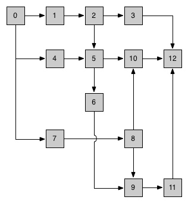

# PantoJS<sup>®</sup>
[![NPM version][npm-image]][npm-url] [![Downloads][downloads-image]][npm-url] [![Build Status][travis-image]][travis-url] [![Coverage Status][coveralls-image]][coveralls-url] [![Dependency status][david-dm-image]][david-dm-url] [![Dev Dependency status][david-dm-dev-image]][david-dm-dev-url]

_**[PantoJS<sup>®</sup>](http://pantojs.xyz/)**_ 是一个***极其灵活***的文件转换引擎，通常用于项目的构建和编译，特别是 Web 前端项目。

它比较类似于 [Grunt](http://gruntjs.com) 或 [Gulp](http://gulpjs.com)，但更**高效**、**强大**和**灵活**。

## 核心特性

+ 支持任意定义的拓扑构建流程

> 只要是你能定义出来的构建流程，无论如何复杂，只要是合理的，*Panto* 都可以支持

+ 支持遗留文件的收集

> 在选择特定的文件类型后，可以一次性访问到未被选择的其它文件

+ 保证对每个源文件最多读取一次

> 对于同一个文件存在一个以上不同的处理流程，读取也最只有一次

+ 保证对于每个文件的同样处理流程只有一次

> 尽最大努力避免重复工作

+ 支持文件级别的精确缓存，最大程度上避免不必要的计算

> 不必重新构建的文件，尽最大努力利用缓存

+ 支持文件级别的精确增量构建

> 高效重复构建

## 与Grunt/Gulp相比

|      | Grunt | Gulp | Panto |
| ---- | ----- | ---- | ----- |
| 流式任务 | ✘     | ✔    | ✔     |
| 拓扑流程 | ✘     | ✘    | ✔     |
| 一次读取 | ✘     | ✘    | ✔     |
| 精确缓存 | ✘     | ✘    | ✔     |
| 精确增量 | ✘     | ✘    | ✔     |

## 快速入门

与 _Grunt_  和 _Gulp_ 一样，_Panto_ 也需要在项目根目录下定义流程配置文件 _pantofile.js_，但不支持 [coffeescript](http://coffeescript.org) 语法。一个最简单的 _pantofile.js_ 内容如下：

```js
module.exports = panto => {};
```

> 注意 _Panto_ 对 _Node.js_ 的最低版本要求是 __6.0.0__，因此可以放心使用 ES2015 的语法。

接着，就像加载 _Grunt/Gulp_ 的插件一样，需要先加载_转换器（Transformer）_。转换器定义了如何变换文件内容的逻辑。

```js
module.exports = panto => {
    panto.loadTransformer('read');
    panto.loadTransformer('less');
    panto.loadTransformer('copy');
    panto.loadTransformer('write');
};
```

以上需要使用npm加载相应的package：

```sh
npm install panto panto-transformer-read panto-transformer-less panto-transformer-copy panto-transformer-write --save-dev
```

下面先要定义几个参数：`cwd`、`src`、`output`。其中 `src`、`output` 相对于 `cwd`：

```js
panto.setOptions({
    cwd: __dirname,
    src: 'src',
    output: 'output'
});
```

现在开始定义构建流程，这里以转换less文件为例：

```javascript
panto.pick('*.less').read().less().write();
```

这个流程的意义是在 `src` 目录内搜索以 _.less_ 为扩展名的文件，并读取其内容，转换为CSS格式，并写入 `output` 的对应目录内。比如 _src/style/foo.less_，转换后写入 _output/style/foo.less_。

现在，我们把除了less文件以外的其它文件拷贝到 `output` 中：

```js
panto.rest().copy();
```

那么 _src/config/c.yml_ 拷贝至 _output/config/c.yml_。

现在，完整的构建配置文件的内容是：

```js
module.exports = panto => {
    panto.loadTransformer('read');
    panto.loadTransformer('less');
    panto.loadTransformer('copy');
    panto.loadTransformer('write');

    panto.setOptions({
        cwd: __dirname,
        src: 'src',
        output: 'output'
    });

    panto.pick('*.less').read().less().write();
    panto.rest().copy();
};
```

你可以使用 [load-panto-transformers](http://npmjs.org/load-panto-transformers) 来避免书写大量 _panto.loadTransformer('xxx')_ 语句，同时你也可以使用 [time-panto](http://npmjs.org/time-panto) 来监控构建信息，这样，简化并完整的 _pantofile.js_ 是：

```javascript
module.exports = panto => {
    require('load-panto-transformers')(panto);
    require('time-panto')(panto);

    panto.setOptions({
        cwd: __dirname,
        src: 'src',
        output: 'output'
    });

    panto.pick('*.less').read().less().write();
    panto.rest().copy();
};
```

最后，为了在命令行环境下调用构建任务，你需要先安装 [panto-cli](http://npmjs.org/panto-cli)：

```sh
npm install panto-cli -g
```

在命令行中执行：

```sh
panto -f pantofile.js
```

以上示例请参考 <https://github.com/pantojs/simple-panto-usage>。

## 转换器

__*转换器(Transformer)*__ 定义了如何转换文件的逻辑。实现一个 *Transformer* 可以继承自 [*panto-transformer*](http://npmjs.org/panto-transformer)：

```js
const Transformer = require('panto-transformer');

class FooTransformer extends Transformer {
    _transform(file) {
        file.content += 'A';
        return Promise.resolve(file);
    }
    isTorrential() {
      return false;
    }
    isCacheable() {
      return true;
    }
}

module.exports = FooTransformer;
```

如果文件的转换是相互独立的，那么实现 _\_transform_ 方法即可，否则需要实现 _transformAll_ 方法，它们都返回 Promise 对象，两种转换器使用 _isTorrential()_ 方法来区分。具体请参见 [panto-transformer-browserify](https://github.com/pantojs/panto-transformer-browserify) 与 [panto-transformer-uglify](https://github.com/pantojs/panto-transformer-uglify) 的不同实现。

如果转换器是严格幂等的，则是可缓存的，这通过 _isCacheable()_ 方法来区分。任何可能通过文件内容之外其它因素导致两次转换结果不一致的情景，都不能是可缓存的。例如，计算内容md5值的逻辑，只要内容相同，md5值即是一样的，不涉及任何其它因素，这就是可缓存的。再例如，为文件增加当前时间的时间戳内容，则一定是不可缓存的。

转换器的输入和输出都是文件对象或者是集合。文件对象是一个纯JavaScript对象（PlainObject），至少包含 *filename* 和 *content* 两个属性，你也可以增加其它属性。

## 流

*Panto* 使用流（Stream）来定义转换任务。作为节点，流可以构建为任意的有向无环图。

```javascript
const Stream = require('panto').Stream;
const s1 = new Stream();
const s2 = new Stream();
const s3 = new Stream();
const s4 = new Stream();

s1.connect(s2).connect(s4);
s1.connect(s3);
```
以上代码构建的拓扑图如下：


流以一个转换器为构造参数，但也可以不传入任何参数。

```javascript
new Stream(new Transformer())
```

通过定义拓扑流和转换器，可以简洁和清晰地描述如何构建一个项目。下面是一个复杂的构建流程示例：



一个更典型的配置案例：

```js

module.exports = panto => {
	panto.setOptions({
    	cwd: __dirname,
	    src: 'src',
    	output: 'output' // 不可以与src相同
	});

	require('load-panto-transformers')(panto);

	const srcJs = panto.pick('**/*.{js,jsx}').tag('js(x)').read();

	srcJs.babel(clientBabelOptions).write();

	srcJs.babel(serverBabelOptions).write();

	panto.pick('**/*.less').tag('less').read().less().write();

	// node_modules 的文件只需处理一次
	panto.pick('node_modules/**/*', true).tag('node_modules').copy();

	panto.rest().tag('others').ignore().copy();
}

```

## API

`Panto` 也可以使用 API 调用：

```javascript
const panto = require('panto');

panto.on('start', buildId => {})
    .on('flowstart', ({tag}, flowId) => {})
    .on('flowend', ({tag}, flowId) => {})
    .on('error', (err, buildId) => {})
    .on('complete', (files, buildId) => {})

panto.build().then(() => {
    panto.watch();
});
```


## 模板

- [panto-best-practice](https://github.com/pantojs/panto-best-practice)
- [simple-panto-usage](https://github.com/pantojs/simple-panto-usage)

## 转换器

一些官方的转换器：

- [read](https://github.com/pantojs/panto-transformer-read)
- [write](https://github.com/pantojs/panto-transformer-write)
- [babel](https://github.com/pantojs/panto-transformer-babel)
- [filter](https://github.com/pantojs/panto-transformer-filter)
- [ignore](https://github.com/pantojs/panto-transformer-ignore)
- [integrity](https://github.com/pantojs/panto-transformer-integrity)
- [less](https://github.com/pantojs/panto-transformer-less)
- [uglify](https://github.com/pantojs/panto-transformer-uglify)
- [stamp](https://github.com/pantojs/panto-transformer-stamp)
- [aspect](https://github.com/pantojs/panto-transformer-aspect)
- [browserify](https://github.com/pantojs/panto-transformer-browserify)
- [replace](https://github.com/pantojs/panto-transformer-replace)
- [copy](https://github.com/pantojs/panto-transformer-copy)
- [resource](https://github.com/pantojs/panto-transformer-resource)
- [banner](https://github.com/pantojs/panto-transformer-banner)


[npm-url]: https://npmjs.org/package/panto
[downloads-image]: http://img.shields.io/npm/dm/panto.svg
[npm-image]: http://img.shields.io/npm/v/panto.svg
[travis-url]: https://travis-ci.org/pantojs/panto
[travis-image]: http://img.shields.io/travis/pantojs/panto.svg
[david-dm-url]: https://david-dm.org/pantojs/panto
[david-dm-image]: https://david-dm.org/pantojs/panto.svg
[david-dm-dev-url]: https://david-dm.org/pantojs/panto?type=dev
[david-dm-dev-image]: https://david-dm.org/pantojs/panto/dev-status.svg
[coveralls-image]: https://coveralls.io/repos/github/pantojs/panto/badge.svg?branch=master
[coveralls-url]: https://coveralls.io/github/pantojs/panto?branch=master
